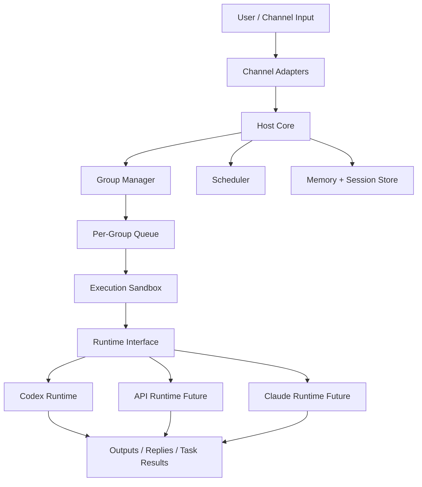
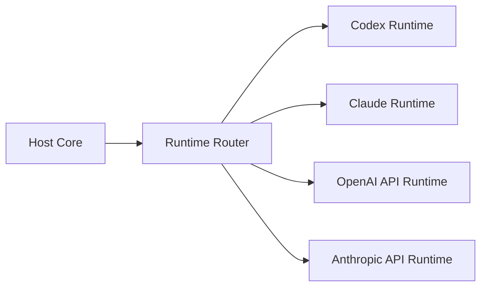

# Technical Architecture

## 1. Overview

This project is structured in layers so the host can remain stable while the runtime changes.



## 2. Design Principles

### 2.1 Host and Runtime Separation

The host should own:

- groups
- tasks
- queues
- memory
- permissions
- execution boundaries

The runtime should own:

- model session semantics
- message execution
- streaming behavior
- tool-call behavior
- provider-specific auth integration

### 2.2 Security First

Security is not delegated to the runtime alone.

The host must enforce:

- isolated working directories
- controlled mounts
- explicit task execution boundaries
- per-group state separation
- auditable event logging

### 2.3 Runtime Pluggability

The runtime contract should be narrow and explicit so additional runtimes can be added later without changing core host logic.

## 3. Layer Breakdown

### 3.1 Channel Layer

Purpose:

- accept inbound messages
- normalize metadata
- route to the correct group
- deliver outbound responses

V1 target:

- one local/dev channel

Future examples:

- Slack
- Telegram
- WhatsApp
- email

### 3.2 Host Core

Purpose:

- task admission
- routing
- queue management
- runtime dispatch
- basic policy enforcement

Main responsibilities:

- create or locate target group
- decide whether input becomes a chat turn or scheduled task
- persist metadata
- invoke runtime inside sandbox

### 3.3 Group Manager

Purpose:

- isolate group state
- bind memory, queue, and session history to a group

Each group owns:

- local memory
- working directory
- task history
- session metadata

### 3.4 Queue and Scheduler

Queue:

- per-group FIFO execution
- prevents concurrent corruption within a group

Scheduler:

- recurring tasks
- one-shot tasks
- retry/backoff hooks

### 3.5 Memory and Session Store

Purpose:

- store hierarchical memory
- persist session identifiers
- store transcripts and execution metadata

V1 should separate:

- global memory
- group memory
- transient runtime session state

### 3.6 Execution Sandbox

Purpose:

- run work in a controlled directory boundary
- isolate files and tools from host state

Possible V1 options:

- local constrained directory model
- Docker-backed sandbox

### 3.7 Runtime Interface

Recommended initial interface:

```ts
export interface AgentRuntime {
  name: string;
  createSession(input: RuntimeSessionInput): Promise<RuntimeSession>;
  runTurn(input: RuntimeTurnInput): AsyncIterable<RuntimeEvent>;
  cancel(sessionId: string): Promise<void>;
  close(sessionId: string): Promise<void>;
  capabilities(): RuntimeCapabilities;
}
```

Supporting types:

```ts
export interface RuntimeSessionInput {
  groupId: string;
  workingDirectory: string;
  memoryFiles: string[];
  systemInstructions?: string;
}

export interface RuntimeTurnInput {
  sessionId: string;
  messages: RuntimeMessage[];
  tools?: RuntimeToolSpec[];
}

export type RuntimeEvent =
  | { type: "message"; text: string }
  | { type: "tool_call"; name: string; payload: unknown }
  | { type: "tool_result"; name: string; payload: unknown }
  | { type: "status"; value: string }
  | { type: "error"; error: string }
  | { type: "done"; usage?: unknown };
```

## 4. Codex Runtime

### 4.1 Purpose

The first runtime should support Codex as a real runtime target, not as an emulated Anthropic endpoint.

### 4.2 Responsibilities

- initialize Codex session context
- load working directory and memory context
- execute a turn
- stream results back to host
- map usage/errors into host events

### 4.3 Auth Strategy

Preferred path:

- official Codex CLI / supported login flow

The runtime should not make the host depend directly on a proprietary SDK if the CLI/session path is sufficient for V1.

### 4.4 Risks

- session behavior may differ from Claude-style runtimes
- streaming event mapping may need normalization
- runtime auth lifecycle may require explicit health checks

## 5. Future Multi-Provider Direction

Once the runtime boundary is proven with Codex, the same host can later support:

- ClaudeRuntime
- OpenAI APIRuntime
- Anthropic APIRuntime
- gateway-backed compatible runtimes

At that point the architecture becomes:



## 6. Recommended V1 Outcome

V1 is successful if:

- one group can receive a message
- that message is executed through `CodexRuntime`
- output is streamed back
- a scheduled task can run through the same runtime
- memory and working directory boundaries remain isolated
